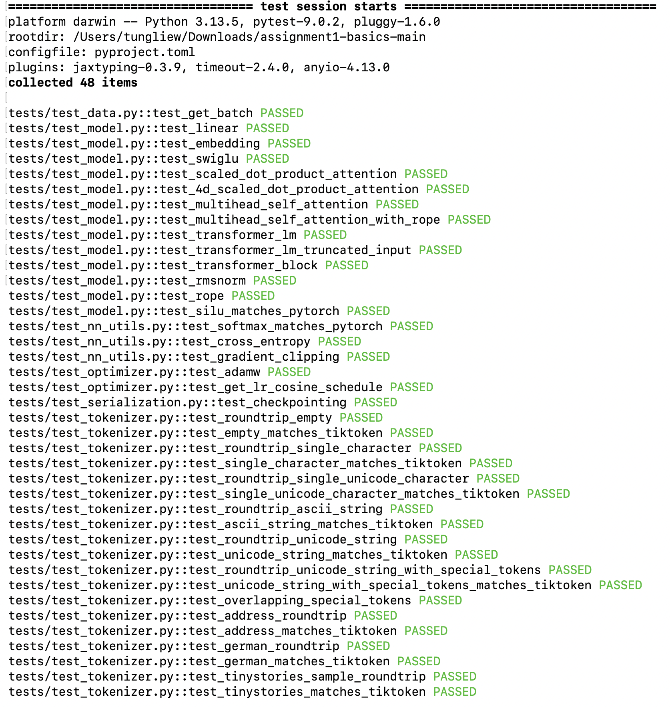
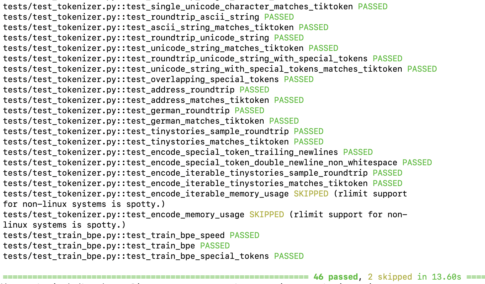
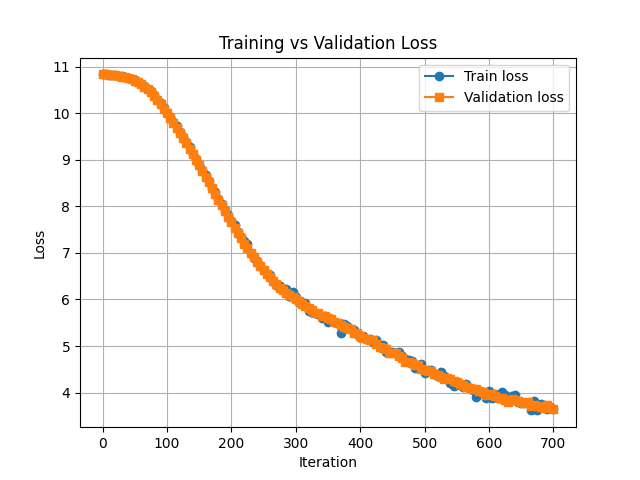

# Stanford CS336 Assignment1 Spring 2026
 

## 6月5日 Update
### 用DeepSeek_V4的Compressed Sparse Attention(CSA)替换Multi Head Attention(MHA)
 

- 在CPU上进行训练
- vocab_size = 10,000
- max_iters = 1,000

 
**MHA Transformer** 训练时长 ~ 2h 40min, best val loss **2.9422**
**CSA Transformer** 训练时长 ~ **45min**, best val loss  **3.6928**
 
**使用各自训练后模型进行文本生成测试**
- prompt = "The dragon opened the door"
 
- MHA生成文本如下：
The dragon opened the door and tried to find the shiny and eat it. He looked at the house and saw a big tree. He wanted to catch the truck. 
"Look, a stick!" he said. "We will not some cake!"  
"Yes, I can't take his food home!"  
They ran to the park and told them to help each other. They played in the forest, and they had a great time. They were happy to have a fun day. 
<|endoftext|>  
 
- CSA生成文本如下：
The dragon opened the door and the story is a big hole. They look at the tree. They did not want to play with the store and a swing.  
One day, a time, "Do you, but the box of the bird flew away. 
They played together. They were very small toy again. 
They played together. They were very happy that they saw the box with the chain.  
<|endoftext|>  

 
Summary: 
1. CSA的best_val_loss与MHA的best_val_loss仍然有差距
2. 但是**训练速度上有极大提升，MHA训练时间 ~= CSA训练时间 * 3.5**, 能够极大缩短训练时间

## 所有functions测试结果
46 passed, 2 skipped 
  

 

## BPETokenizer 训练结果
1. 在TinyStories数据集上进行训练
2. vocab_size = 10,000
3. 训练时长 大约35min

 

## TransformerLM 模型训练结果
1. 同样在TinyStories数据集上进行训练  
2. 全程CPU训练，训练时长大约3h  
   (因为中间使用过GPT-2 tokenizer做过测试，训练时忘记把vocab_size改回10,000了，直接用vocab_size=50,257进行的训练，除了参数变多其他没有影响） 
4. 资源内容统计  
- MODEL CONFIG  
vocab_size      : 50,257
context_length  : 256 
num_layers      : 4
d_model         : 512
num_heads       : 16
d_ff            : 1,344

- PARAMETERS  
Total parameters: 63,919,616

- MEMORY  
Memory (bytes): 1,022,713,856
Memory (MB):    975.34
Memory (GB):    0.95

- FORWARD PASS FLOPs  
FLOPs per layer: 1,728,053,248
Transformer FLOPs: 6,912,212,992
LM head FLOPs: 13,174,571,008

Total forward FLOPs: 20,086,784,000
Total TFLOPs: 0.020

5. 训练结果loss的变化  
   

猜测可能由于当前数据复杂度>模型复杂度，而且train dataset和val dataset分布较为一致，所以学习过程中train loss和val loss比较接近，loss曲线重合比较高

## 使用训练后模型生成文本
prompt = "The dragon opened the door" 
   生成文本如下： 
  The dragon opened the door. The bird said, "I love you for the bird. What fly."
"Maybe you have a small forest!" laughed and Lily. Tom said, "That's you sad, Lily. I don'
"I am sad and play with you," was so much.
One day, Tom can the heavy tree.
"No, you are not many boat's, and be careful. Tim's okay, I want to be careful on the good
Tom's mom went to the bunny and the dog and the car every day.
"I will go. You don't find his friends."
"OK, I'm proud of the ball's friend. She wanted to be toys. You can play together. He foun
The dog was scared. She decided to give her friends. The boy saw the tree and was so tired
<|endoftext|>
